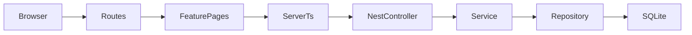

# Hotel Domain Guide (beginner-friendly)

This guide explains **only the hotel part** of the island booking app: which files to open, how data flows, and how to add new UI or database fields step by step.

You should already know how to start the app. If not, read [app-guid.md](./app-guid.md) first.  
For general frontend / backend patterns, see [frontend-guid.md](./frontend-guid.md) and [backend-guid.md](./backend-guid.md).

---

## 1. What is the hotel domain?

Two kinds of people use hotels:


| Who          | What they do                                              | Frontend folder                              |
| ------------ | --------------------------------------------------------- | -------------------------------------------- |
| **Visitors** | Browse hotels, view rooms, book, see My bookings          | `apps/frontend/src/features/hotel-browsing/` |
| **Staff**    | Dashboard, manage rooms/room types, assign rooms, reports | `apps/frontend/src/features/hotels/`         |


The **backend** stores hotels, rooms, bookings, and enforces rules (availability, who can cancel, which staff can see which hotel).

Think of it like a resort:

- **Frontend** = the reception desk and guest brochure
- **Backend** = the reservation book + house rules
- **Database** = the filing cabinet

---


## 2. Mental model — how a click becomes data

When a visitor opens `/hotels/1`, this chain runs:




| Layer            | Where                       | Job                                 |
| ---------------- | --------------------------- | ----------------------------------- |
| **URL**          | `apps/frontend/src/routes/` | “This address shows this page”      |
| **Screen**       | `features/*/pages/`         | What you see                        |
| **Phone to API** | `features/*/server.ts`      | Calls the backend safely            |
| **Door**         | `modules/*/controller.ts`   | HTTP route (`GET /public/hotels/1`) |
| **Brain**        | `modules/*/service.ts`      | Rules (“is this booking allowed?”)  |
| **Librarian**    | `modules/*/repository.ts`   | SQL / Drizzle reads & writes        |
| **Cabinet**      | `shared/database/schema/`   | Table definitions                   |


**Golden rule:** routes stay thin → pages draw UI → `server.ts` talks to the API → service owns rules → repository owns SQL → schema owns tables.

API base URL: `http://localhost:4000/api/v1`

---


## 3. Database tables (hotel-related)

Schema files live in:

`apps/backend/src/shared/database/schema/`

They are exported from `schema/index.ts`. Migrations are generated with Drizzle (`npm run db:generate` then `npm run db:migrate` inside `apps/backend`).


| Table                 | Schema file                     | Plain English                                                                  |
| --------------------- | ------------------------------- | ------------------------------------------------------------------------------ |
| `hotels`              | `hotels.schema.ts`              | A place to stay (name, description, map pin, max rooms)                        |
| `room_types`          | `room-types.schema.ts`          | Catalog of villa types (Garden Villa, Overwater Villa…) with price & occupancy |
| `rooms`               | `rooms.schema.ts`               | Physical rooms in a hotel (`101`, `102`) of a given room type                  |
| `amenities`           | `amenities.schema.ts`           | Shared list (Wi‑Fi, bathtub, rain shower…)                                     |
| `room_type_amenities` | `room-type-amenities.schema.ts` | Links room types ↔ amenities (many-to-many)                                    |
| `hotel_bookings`      | `hotel-bookings.schema.ts`      | A guest reservation                                                            |
| `images`              | `images.schema.ts`              | Image URLs                                                                     |
| `imageables`          | `imageables.schema.ts`          | Links images to hotels or room types                                           |
| `map_locations`       | `map-locations.schema.ts`       | Pins on the island map                                                         |
| `user_assignments`    | `user-assignments.schema.ts`    | Which hotels a staff user can manage                                           |


### The most important booking rule

Visitors book **hotel + room type + dates** (not a specific door number).

- `roomId` on `hotel_bookings` starts as **null**
- Staff later **assign** a physical room before check-in

That rule is documented in `hotel-bookings.schema.ts` and enforced in `hotel-bookings.service.ts`.

### How images attach

Images are **polymorphic**:

1. Insert a row in `images` (`url`)
2. Insert a row in `imageables` with:
  - `imageable_type = 'hotel'` + hotel id, **or**
  - `imageable_type = 'room_type'` + room type id

The public API reads those joins in `public-hotels.repository.ts`.

---


## 4. Backend modules map

Modules live in `apps/backend/src/modules/`.  
Each module is registered in `apps/backend/src/app.module.ts`.


| You need…                                        | Module folder      | Who can call it                 |
| ------------------------------------------------ | ------------------ | ------------------------------- |
| Browse / detail / availability                   | `public-hotels/`   | Anyone (no login)               |
| List hotels for staff                            | `hotels/`          | Admin / hotel staff             |
| Create/edit room types                           | `room-types/`      | Admin / hotel staff             |
| Create/edit physical rooms                       | `rooms/`           | Admin / hotel staff             |
| Create booking, my bookings, cancel, assign room | `hotel-bookings/`  | Visitors (own bookings) + staff |
| Staff KPIs                                       | `hotel-dashboard/` | Admin / hotel staff             |
| Revenue / occupancy charts                       | `hotel-reports/`   | Admin / hotel staff             |


**Amenities** do not have their own Nest module. They are schema + seed data, then joined when reading room types / public hotels.

### Files inside a module (kitchen analogy)


| File              | Simple job                                 |
| ----------------- | ------------------------------------------ |
| `*.controller.ts` | Reception — listens for HTTP               |
| `*.service.ts`    | Brain — business rules + access checks     |
| `*.repository.ts` | Librarian — only place that should run SQL |
| `dto/*.dto.ts`    | Form — validates incoming JSON             |


Shared hotel scoping: `apps/backend/src/shared/hotel-access/hotel-access.service.ts`  
(Admin = all hotels; `hotel_staff` = only hotels in `user_assignments`.)

---


## 5. Frontend map


### Visitor feature — `hotel-browsing`

Path: `apps/frontend/src/features/hotel-browsing/`


| File / folder  | Job                                                     |
| -------------- | ------------------------------------------------------- |
| `types.ts`     | TypeScript shapes matching the public API               |
| `constants.ts` | Filters, money helper (`gbp`), image fallbacks          |
| `server.ts`    | `createServerFn` wrappers → `/public/hotels…`, bookings |
| `queries.ts`   | React Query `queryOptions` / `mutationOptions`          |
| `pages/`       | Full screens                                            |
| `components/`  | Cards, calendar, lightbox, booking sidebar              |


| URL                             | Route file                                | Page                                  |
| ------------------------------- | ----------------------------------------- | ------------------------------------- |
| `/`                             | `routes/index.tsx`                        | `home-page.tsx`                       |
| `/hotels`                       | `routes/hotels/index.tsx`                 | `hotels-browse-page.tsx`              |
| `/hotels/:hotelId`              | `routes/hotels/$hotelId/index.tsx`        | `hotel-detail-page.tsx`               |
| `/hotels/:hotelId/book`         | `routes/hotels/$hotelId/book.tsx`         | `hotel-book-page.tsx`                 |
| `/hotels/:hotelId/confirmation` | `routes/hotels/$hotelId/confirmation.tsx` | `hotel-booking-confirmation-page.tsx` |
| `/my-bookings`                  | `routes/my-bookings/index.tsx`            | `my-bookings-page.tsx`                |


Useful components: `hotel-card.tsx`, `room-option-card.tsx`, `image-lightbox.tsx`, `availability-calendar.tsx`, `booking-summary-panel.tsx`.

### Staff feature — `hotels`

Path: `apps/frontend/src/features/hotels/`

Same file pattern (`types`, `server`, `queries`, `pages`, `components`).  
Staff pages use `hooks/use-current-hotel.ts` to know which hotel is selected.


| URL                         | Page                       |
| --------------------------- | -------------------------- |
| `/dashboard/hotel`          | `hotel-dashboard-page.tsx` |
| `/dashboard/hotel/rooms`    | `rooms-page.tsx`           |
| `/dashboard/hotel/bookings` | `hotel-bookings-page.tsx`  |
| `/dashboard/hotel/reports`  | `hotel-reports-page.tsx`   |


Layout + role guard: `routes/dashboard/hotel/route.tsx` (`admin` or `hotel_staff`).

Useful components: `room-dialog.tsx`, `room-type-dialog.tsx`, `assign-room-dialog.tsx`, status badges, charts.

**Never edit** `apps/frontend/routeTree.gen.ts` — it regenerates when you run `npm run dev`.

---


## 6. Recipe A — Add a frontend feature


### A1. Show a new field that the API already returns

Example: show `description` more prominently on the hotel card.

1. Open `features/hotel-browsing/types.ts` and confirm the field exists on the type (e.g. `HotelSummary`).
2. Open the component/page (e.g. `components/hotel-card.tsx`).
3. Render it with existing styles / helpers (`gbp`, badges from `constants.ts`).
4. Refresh the browser.

No `server.ts` change needed if the endpoint already returns the field.

### A2. New section on an existing page

1. Prefer editing the page under `pages/`, or extract a component under `components/`.
2. Reuse data from the query already loaded with `useSuspenseQuery(...)`.
3. Use shared UI from `~/components/ui/*` and helpers like `~/lib/amenity-icon.tsx`.
4. Leave the route file alone unless you need a new URL.


### A3. New API call on the frontend

1. Add a `createServerFn` in `server.ts` that calls `apiFetch('/your/path')` (see existing examples).
2. Add `queryOptions` / `mutationOptions` in `queries.ts`.
3. Use them in the page.
4. After a mutation, invalidate the right query key, e.g.
  `queryClient.invalidateQueries({ queryKey: ["hotel-bookings"] })`.

**Rule:** do not `fetch` the Nest API directly from browser components for these features — go through `server.ts` so cookies / refresh work.

### A4. Brand-new page / URL

1. Create `features/.../pages/my-page.tsx`.
2. Add server + queries if it needs data.
3. Add a thin route in `src/routes/.../index.tsx` (preload with `ensureQueryData` if needed).
4. Link to it from nav / another page.
5. Save — route tree regenerates in dev.

Copy patterns from:

- Visitor detail: `hotel-detail-page.tsx`
- Staff form dialog: `room-type-dialog.tsx`
- Auth-required page: `my-bookings/index.tsx` or `dashboard/hotel/route.tsx`

---


## 7. Recipe B — Add a column (or table) + rules + UI

Worked example: add `checkInNotes` (text) on the `hotels` table and show it on the visitor detail page.

### Step 1 — Schema

Edit `apps/backend/src/shared/database/schema/hotels.schema.ts`:

```ts
checkInNotes: text('check_in_notes'),
```

If you add a **new table**, create `something.schema.ts` and export it from `schema/index.ts` (and add relations if needed).

### Step 2 — Migrate

```bash
cd apps/backend
npm run db:generate
npm run db:migrate
```


### Step 3 — Read it in repositories

- Staff list/detail: `modules/hotels/hotels.repository.ts` (select the new column).
- **Visitor-facing:** also update `modules/public-hotels/public-hotels.repository.ts`  
(browse + detail queries). Beginners often forget this step!


### Step 4 — Writes (if staff can edit it)

1. Add/update a DTO under `dto/` with `class-validator` (`@IsString()`, `@IsOptional()`, …).
2. Wire create/update in repository + service.
3. Put any rules in the **service** (“notes max length”, “staff must be assigned to this hotel”).


### Step 5 — Controller / auth

- Public read stays on `public-hotels` with `@Public()`.
- Staff write uses JWT + `@Roles(Admin, HotelStaff)` (copy from an existing controller).


### Step 6 — Seed (optional but useful)

Update `apps/backend/src/shared/database/seeds/demo.ts` so demo hotels have sample `checkInNotes`.  
Then re-seed if your workflow allows:

```bash
npm run db:seed
```

(Seed may skip data that already exists — check `seed.ts` / `demo.ts` behaviour if values don’t appear.)

### Step 7 — Frontend

1. Add `checkInNotes?: string | null` to `hotel-browsing/types.ts` (`HotelDetail`).
2. Show it in `hotel-detail-page.tsx` (e.g. Policies tab).
3. No new `server.ts` method if `GET /public/hotels/:id` already returns it.


### Step checklist (copy this)

1. Schema → migrate
2. Repository (public **and/or** staff)
3. DTO + service rules if writable
4. Controller roles
5. Seed
6. Frontend types → page/component
7. Manual test in browser

---


## 8. Rules & auth cheat sheet


### How input is validated

Global `ValidationPipe` in `apps/backend/src/main.ts`:

- strips unknown fields (`whitelist`)
- rejects extra fields (`forbidNonWhitelisted`)
- DTOs use `class-validator` decorators


### Who can call what


| Surface                                                 | Login? | Roles                                 |
| ------------------------------------------------------- | ------ | ------------------------------------- |
| `GET /public/hotels…`                                   | No     | `@Public()`                           |
| Staff hotels / rooms / room-types / dashboard / reports | Yes    | `admin` or `hotel_staff`              |
| `POST /hotel-bookings`, `GET .../mine`, cancel          | Yes    | Any logged-in user (visitor included) |
| Assign room / change booking status                     | Yes    | Admin / hotel staff + hotel access    |


Guards: `shared/guards/jwt-auth.guard.ts`, `roles.guard.ts`.  
Decorators: `@Public()`, `@Roles(...)`, `@CurrentUser()`.

### Business rules (bookings)

Most live in `modules/hotel-bookings/hotel-bookings.service.ts`:

- check-in before check-out; check-in not in the past  
- guests ≤ room type `maxOccupancy`  
- availability = rooms of that type vs overlapping bookings  
- price snapshot = `basePricePerNight × nights`  
- visitor cancel: own booking, pending/confirmed, usually ≥ 48h before check-in  
- assign room: same hotel + same room type + no date overlap on that room

When you add a **new rule**, put it in the **service**, not the controller and not the React page.

---


## 9. Seed data & demo images


| File                            | Role                                                   |
| ------------------------------- | ------------------------------------------------------ |
| `shared/database/seeds/seed.ts` | Roles, users, then calls demo                          |
| `shared/database/seeds/demo.ts` | Hotels, room types, rooms, amenities, bookings, images |


How amenities are linked in seed:

1. Insert rows into `amenities`
2. Insert rows into `room_type_amenities` (room type id + amenity id)

How images are linked: see section 3 (`images` + `imageables`).

After big seed changes, restart or refresh the frontend. If URLs look old, check the DB actually updated (seed is often idempotent and won’t overwrite existing rows).

Test accounts (after seed):


| Email               | Password       | Where                                       |
| ------------------- | -------------- | ------------------------------------------- |
| `hotel@example.com` | `ChangeMe123!` | `/dashboard/hotel` (often scoped to Velara) |
| `admin@example.com` | `ChangeMe123!` | `/dashboard/admin`                          |
| Sign up any email   | your choice    | visitor book / my-bookings                  |


---


## 10. Common mistakes


| Mistake                                        | Fix                                         |
| ---------------------------------------------- | ------------------------------------------- |
| Editing `routeTree.gen.ts`                     | Don’t — let Vite regenerate it              |
| Adding a visitor field only in `hotels` module | Also update `public-hotels.repository.ts`   |
| Calling Nest with raw `fetch` in a page        | Use `server.ts` + `apiFetch`                |
| Forgetting React Query invalidate after save   | Call `invalidateQueries` with the right key |
| Putting business rules only in React           | Enforce them in the Nest **service** too    |
| Migrating from repo root                       | `cd apps/backend` first                     |
| UI change but blank data                       | Backend not running, or need migrate/seed   |


---


## 11. Quick “where do I edit?” cheat sheet


| I want to…                      | Start here                                          |
| ------------------------------- | --------------------------------------------------- |
| Change hotel card look          | `hotel-browsing/components/hotel-card.tsx`          |
| Change room card / gallery      | `hotel-browsing/components/room-option-card.tsx`    |
| Change book flow steps          | `hotel-browsing/pages/hotel-book-page.tsx`          |
| Change staff rooms UI           | `hotels/pages/rooms-page.tsx` + dialogs             |
| Change public hotel JSON        | `public-hotels.repository.ts` (+ service if needed) |
| Change booking rules            | `hotel-bookings.service.ts`                         |
| Change table columns            | `shared/database/schema/*.schema.ts`                |
| Change demo hotels / images     | `shared/database/seeds/demo.ts`                     |
| Restrict which hotels staff see | `shared/hotel-access/hotel-access.service.ts`       |


---


## Files worth bookmarking


| File                                               | Why                             |
| -------------------------------------------------- | ------------------------------- |
| [app-guid.md](./app-guid.md)                       | Run frontend + backend together |
| [frontend-guid.md](./frontend-guid.md)             | General frontend patterns       |
| [backend-guid.md](./backend-guid.md)               | General backend patterns        |
| [hotelImplementation.md](./hotelImplementation.md) | Older hotel module notes        |
| [development-guide.md](./development-guide.md)     | Full monorepo reference         |
| [issuesFaced.md](./issuesFaced.md)                 | Fixes we already found          |


---


## One-sentence summary

**Hotels are tables in schema, rules in Nest services, public JSON in** `public-hotels`**, visitor UI in** `hotel-browsing`**, staff UI in** `hotels` **— change them in that order when you add a feature.**